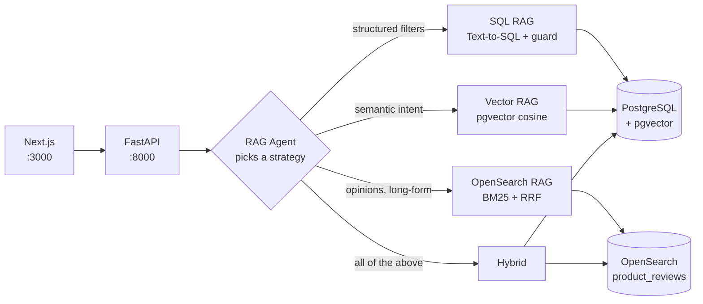

# demo-rag

A small ecommerce catalog wired up to **four different retrieval strategies**, plus an
agent that picks between them and shows you why.

It exists to demonstrate RAG techniques end to end — Text-to-SQL, vector search over
PostgreSQL with pgvector, BM25 full-text search over customer reviews in OpenSearch,
and agentic routing across all three — in a codebase small enough to read in one sitting.

**It runs entirely on your machine with one command and no API keys.**

---

## Quick start

```bash
docker compose up --build
```

Then open **http://localhost:3000**.

That's it. The stack starts Postgres and OpenSearch, waits for both to be healthy, runs a
one-shot ingestion job that loads ~50 products, generates embeddings and indexes reviews,
then starts the API and the web app. First build takes a few minutes; subsequent starts are
fast. Requires Docker with ~4 GB available to the daemon (OpenSearch asks for 512 MB heap).

| URL | What |
|---|---|
| http://localhost:3000 | The demo UI |
| http://localhost:8000/docs | Interactive OpenAPI docs |
| http://localhost:8000/health/ready | Readiness: Postgres, pgvector, OpenSearch doc count |

To stop: `docker compose down`. To wipe the database and start clean: `docker compose down -v`.

There's a `Makefile` wrapping the common tasks — run `make` to see them.

---

## What to try

The UI's **Search** page runs each retrieval strategy in isolation so you can compare them
directly, and the **AI Assistant** page lets the agent choose. Every result is labelled with
the strategy that produced it.

| Ask this | Expected route | Why |
|---|---|---|
| *Which laptops cost less than $1200?* | **SQL** | Pure structured filter — a database does this exactly, a vector index does it approximately |
| *What products have inventory below 5?* | **SQL** | Same; also the kind of question embeddings answer badly |
| *Find ergonomic keyboards for programmers* | **Vector** | Descriptive intent with no literal field to filter on |
| *What do customers complain about?* | **OpenSearch** | The answer lives in long-form review prose, not in product columns |
| *Which ergonomic keyboards under $100 do reviewers recommend?* | **Hybrid** | Needs a price filter **and** semantic matching **and** review evidence |

The agent's routing decision and reasoning are printed to the API logs
(`docker compose logs -f api`) and returned in the response `trace` field, which the UI
renders in a collapsible panel.

---

## Architecture



Full request-flow and pipeline detail: **[docs/architecture.md](docs/architecture.md)**.

### Monorepo layout

```
demo-rag/
├── apps/frontend/         Next.js 16 · React 19 · TypeScript · Tailwind
├── services/api/          FastAPI · SQLAlchemy · pgvector · opensearch-py
│   ├── app/rag/           the four retrieval strategies + SQL safety guard
│   ├── app/agent/         routing agent
│   ├── app/prompts/       prompts as .md files, never inline in Python
│   └── tests/             71 tests, no database required
├── packages/shared-types/ TypeScript types shared with the frontend
├── data/products.json     ~50 seed products with specs and reviews
└── docs/                  architecture, RAG internals, API, demo script, decisions
```

---

## Running without Docker

Useful if you want hot reload while reading the code.

```bash
make install                              # venv + npm install
docker compose up postgres opensearch     # just the data stores
make ingest                               # load + embed + index
make dev-api                              # terminal 2 → :8000
make dev-web                              # terminal 3 → :3000
```

Requires Python 3.11+ and Node 20+. No `.env` file is needed — every setting has a working
default in [`services/api/app/config.py`](services/api/app/config.py). See
`services/api/.env.example` if you want to change something.

---

## Optional: real models

The demo is fully functional offline. Two independent upgrades swap in real models, and
neither changes any application code — both are selected in config and resolved behind the
interfaces in [`app/core/llm.py`](services/api/app/core/llm.py).

**Real LLM reasoning** (Text-to-SQL, agent routing, answer synthesis):

```bash
LLM_PROVIDER=anthropic ANTHROPIC_API_KEY=sk-ant-... docker compose up --build
```

**Real dense embeddings** (semantic search quality):

```bash
EMBEDDING_PROVIDER=voyage VOYAGE_API_KEY=pa-... docker compose up --build
```

### What the defaults actually do

Being precise about this, because "it works without an API key" usually hides a catch:

- **`LLM_PROVIDER=mock`** — Text-to-SQL, routing, and answer synthesis run on deterministic
  rules (regex extraction of price/category/brand filters, keyword-based routing). It
  produces valid SQL that passes the same safety guard and exercises the entire pipeline,
  but it is not doing language understanding. Swap in Claude to see real generation.
- **`EMBEDDING_PROVIDER=local`** — a hashing vectorizer over word unigrams and bigrams
  (the "hashing trick", as in scikit-learn's `HashingVectorizer`), with stopword removal
  and suffix normalization, L2-normalized so cosine similarity works. This is **real
  lexical retrieval**: *"ergonomic keyboards for programmers"* ranks `ErgoSplit Pro
  Mechanical` first against the actual catalog, and a test asserts it stays that way.
  What it can't do is match *"laptop"* to *"notebook"* — it only sees surface tokens.
  Voyage gives you true semantic matching.

Both write to the same `vector(1024)` column and use the same query path, so switching
providers changes retrieval quality without touching the schema or the search code.

---

## Design decisions

Short version; the reasoning is in **[docs/decisions.md](docs/decisions.md)**.

| Decision | Why |
|---|---|
| **FastAPI over serverless** | Long-running RAG requests, straightforward debugging, no cold starts, trivially runnable locally |
| **PostgreSQL + pgvector, not a dedicated vector DB** | The catalog is already relational. One store means SQL filters and vector search can join, and hybrid retrieval doesn't need a distributed transaction |
| **OpenSearch alongside pgvector** | Different jobs. BM25 with an English analyzer beats embeddings on *"what do customers complain about"*; embeddings beat BM25 on paraphrase. The demo shows both, and fuses them with RRF |
| **A router, not a ReAct loop** | One routing decision, then fan-out, then one synthesis call. For a catalog this size an unbounded loop adds latency and failure modes without better answers — and it stays auditable |
| **Prompts in `.md` files** | Reviewable in diffs, editable without touching Python. A test asserts they never get inlined |
| **Generated SQL goes through a guard** | Allowlisted tables, single read-only statement, mandatory `LIMIT`, executed in a transaction that always rolls back. See `app/rag/sql_guard.py` |
| **Providers behind interfaces** | The offline defaults exist so this repo can be cloned and run. The same seam is how you'd add Bedrock, OpenAI, or a local model |

---

## Tests

```bash
make test     # 71 tests, no database or network required
make lint     # ruff + black + tsc
```

The suite covers the SQL injection guard, agent routing and its fallbacks, embedding
properties, prompt loading, OpenSearch snippet handling, and seed-data invariants (it
asserts the documented demo questions actually have answers in the data).

Retrieval *quality* is deliberately not unit-tested — that's an evaluation problem, not an
assertion problem. [docs/rag.md](docs/rag.md#evaluation) covers how it would be measured.

---

## Documentation

| Doc | Contents |
|---|---|
| [docs/architecture.md](docs/architecture.md) | Components, request flow, data model, diagrams |
| [docs/rag.md](docs/rag.md) | Each strategy in depth: Text-to-SQL, pgvector, BM25, RRF fusion, routing, indexing |
| [docs/api.md](docs/api.md) | Every endpoint with request/response examples |
| [docs/demo.md](docs/demo.md) | A scripted walkthrough with expected outputs |
| [docs/decisions.md](docs/decisions.md) | Engineering trade-offs, what's deliberately missing, what production would need |

---

## Known limitations

Stated plainly, because a demo that pretends to be production is worse than one that
doesn't:

- **No authentication.** Every endpoint is open. Real deployment needs authn/authz.
- **`POST /ingest` is destructive and unauthenticated** — it truncates and reloads. Fine for
  a demo you reset constantly; unacceptable anywhere else.
- **Default providers are not real models** — see the section above for exactly what they do.
- **Single-node everything**, no connection pooling limits, no rate limiting, no caching.
- **The IVFFlat index is oversized for 50 products** — a sequential scan is faster at this
  volume. It's there to show the index exists and is analyzed after ingestion.
