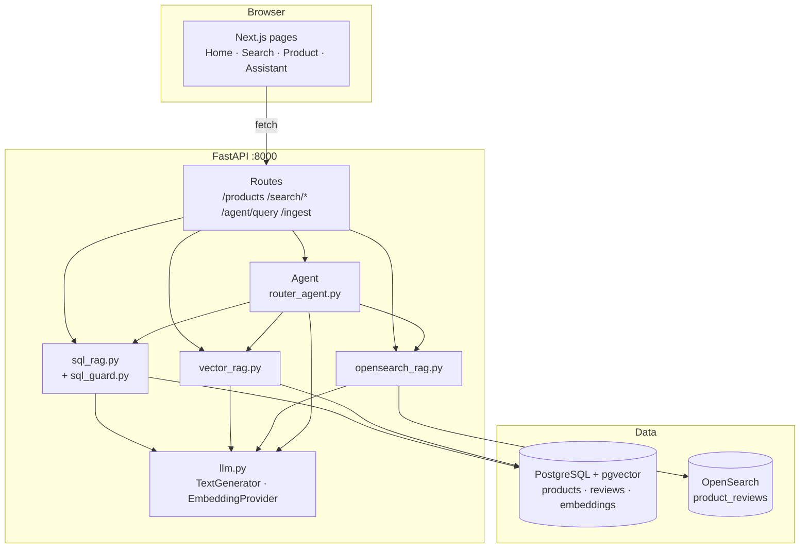
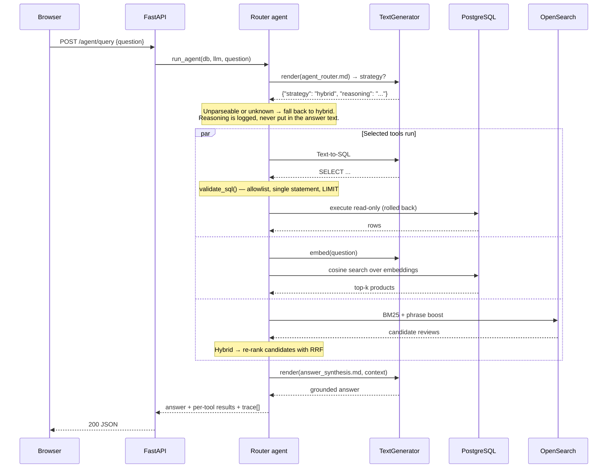
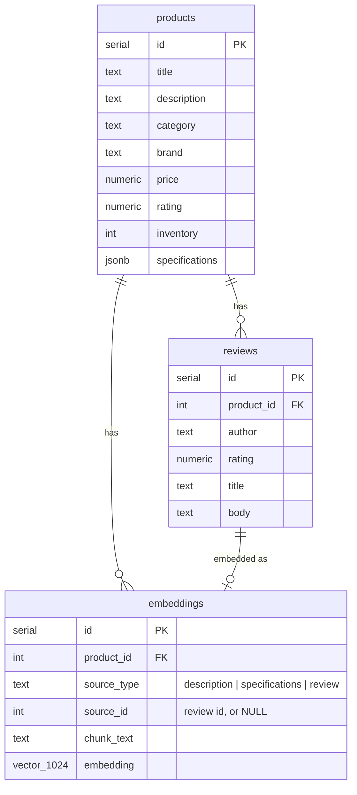

# Architecture

## Overview

Four components, all running locally:

| Component | Tech | Port | Role |
|---|---|---|---|
| **Web** | Next.js 16, React 19, TypeScript, Tailwind | 3000 | UI. Compares retrieval strategies side by side and shows the agent's reasoning |
| **API** | FastAPI, Python 3.11+ | 8000 | REST API. Owns all retrieval logic, prompts, and the SQL safety guard |
| **PostgreSQL** | postgres:16 + pgvector | 5432 | Product catalog **and** the vector index — one store, not two |
| **OpenSearch** | opensearch:2.17 | 9200 | Full-text index over customer reviews |

## Request flow: `POST /agent/query`

The most interesting path — it exercises everything.

For a single-tool route the tool has already produced a grounded answer, so the
agent reuses it rather than paying for a second synthesis call. Only hybrid
routes run the extra synthesis step.

## Data model

One `embeddings` table with a `source_type` discriminator, rather than a vector
column on each table. That keeps a single index to query and a single insert
path, and means adding a new embeddable field is a new `source_type` value
rather than a migration.

Indexes: B-tree on `category`, `brand`, `price`, `rating` for the SQL path;
IVFFlat with `vector_cosine_ops` on `embeddings.embedding` for the vector path,
with `ANALYZE` run after ingestion so the planner will use it.

## Why each technology

| Choice | Reason | What was rejected |
|---|---|---|
| **FastAPI** | Async, Pydantic validation shared with the OpenAPI schema, no cold starts, trivial to run locally | Lambda/serverless: cold starts and timeouts fight long RAG requests, and it's harder to hand someone a repo they can just run |
| **PostgreSQL + pgvector** | The catalog is already relational. Keeping vectors in the same database lets a filter and a similarity search live in one query and one transaction | A dedicated vector DB: a second store to run, seed, and keep consistent, for a corpus of ~150 chunks |
| **OpenSearch** | BM25 with an English analyzer is genuinely better than embeddings at *"what do customers complain about"* — stemming, phrase proximity, term saturation | Only pgvector: would work, but then there's no honest lexical-vs-semantic comparison to demo |
| **Next.js App Router** | Server components fetch catalog data directly; client components handle the interactive search | An SPA: more plumbing for no benefit here |
| **Provider interfaces for LLM/embeddings** | The repo has to run with no API keys, but must not *pretend* the offline path is a real model. Two small interfaces make the swap a config change | Hardcoding one provider: makes the demo unrunnable without an account |

## Where the code lives

| Path | Responsibility |
|---|---|
| `app/api/routes/` | HTTP surface only — validation and delegation, no retrieval logic |
| `app/api/deps.py` | DI: request-scoped DB session, process-wide LLM client |
| `app/rag/sql_rag.py` | Text-to-SQL: generate → validate → execute → format |
| `app/rag/sql_guard.py` | The safety layer. Pure functions, heavily tested |
| `app/rag/vector_rag.py` | Query embedding, pgvector cosine search, per-product dedup |
| `app/rag/opensearch_rag.py` | BM25, phrase boosting, RRF fusion, safe highlighting |
| `app/rag/ingestion.py` | The indexing pipeline; idempotent |
| `app/agent/router_agent.py` | Strategy selection, fan-out, fallbacks, trace |
| `app/core/llm.py` | Provider interfaces and implementations |
| `app/core/prompts.py` | Loads prompts from `app/prompts/*.md` |

The dependency direction is one-way: `routes → agent/rag → core → db`. Nothing
in `core` imports from `rag`, and nothing in `rag` imports from `routes`.
