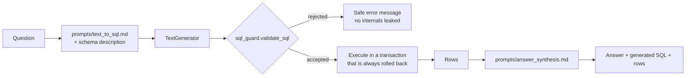
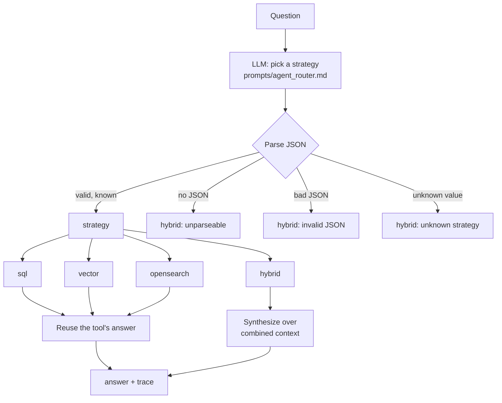
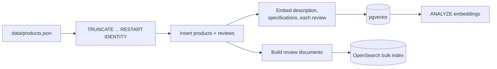

# RAG internals

Four retrieval strategies, why each exists, and how they're implemented.

The organising idea: **different questions have different right answers about
where to look.** "Which laptops cost less than $1200" is a `WHERE` clause.
"Find ergonomic keyboards for programmers" is a similarity search. "What do
customers complain about" is a full-text query over prose. A system with only
one retrieval mechanism answers two of those three badly.

---

## 1. SQL RAG (Text-to-SQL)

**Use for:** exact filters — price, inventory, category, brand, rating.

**Why not embeddings:** `price < 1200` is a predicate, not a similarity.
Embeddings approximate it and get it wrong at the boundary; SQL is exact and
returns a complete result set.

### Pipeline



The generated SQL is returned to the client and rendered in the UI. That's a
deliberate demo affordance — you can see exactly what the model wrote.

### The guard

`app/rag/sql_guard.py`. Prompt instructions are not a security control, so the
statement is validated before it reaches the database:

1. Strip markdown fences and SQL comments — comments can hide payloads from a
   naive keyword scan, so they're removed *before* analysis.
2. Exactly one statement: no semicolons except an optional trailing one.
3. Must start with `SELECT` or `WITH`.
4. Reject forbidden keywords on **word boundaries** — so `created_at` doesn't
   trip the `create` rule.
5. Reject `pg_*` and `information_schema` (system catalogs).
6. Every table after `FROM`/`JOIN` must be in `{products, reviews}`, plus any
   CTE the query defines itself. `embeddings` is deliberately not exposed.
7. Append `LIMIT 50`, or clamp a larger one.

Execution adds one more layer: the statement runs in a transaction that is
**always rolled back**, so nothing can persist even if a write slipped through.

What's missing for production is a database-enforced layer — a role with
SELECT-only grants. That's the one that still holds when everything above is
wrong. See [decisions.md](decisions.md).

---

## 2. Vector RAG (pgvector)

**Use for:** descriptive intent with no literal field to filter on.

### Indexing

At ingestion each product produces two vectors, and each review one more:

| `source_type` | Text embedded |
|---|---|
| `description` | `"{title}. {description}"` |
| `specifications` | Flattened to prose (see below) |
| `review` | `"{review title}. {review body}"` |

Specifications are a JSONB blob, and embedding raw JSON gives poor results —
the model mostly sees punctuation and key names. `_specs_to_text()` renders
`{"switch_type": "tactile"}` as `"switch type: tactile"` in a sentence
alongside the product title, so the vector carries real content.

### Querying

```sql
SELECT * FROM (
    SELECT DISTINCT ON (e.product_id)
           e.product_id, e.source_type,
           1 - (e.embedding <=> CAST(:qv AS vector)) AS score
    FROM embeddings e
    WHERE e.source_type = ANY(:source_types)
    ORDER BY e.product_id, e.embedding <=> CAST(:qv AS vector)
) best
ORDER BY best.score DESC
LIMIT :top_k
```

`<=>` is pgvector's cosine distance. `DISTINCT ON` keeps the single best chunk
per product so a product with a strong description and a weak spec sheet
appears once, ranked by its best match — the UI shows products, not chunks. The
response reports which field matched, which makes the behaviour legible.

Only `description` and `specifications` participate: review-flavoured questions
route to OpenSearch, which does a better job on long-form prose.

### Embedding providers

Both produce L2-normalized `vector(1024)` values, so they're interchangeable
without a schema change.

- **`local` (default)** — hashing vectorizer over word unigrams and bigrams.
  Each token is hashed to a bucket with a sign, weighted by sublinear term
  frequency (`1 + log tf`), then L2-normalized. Real lexical retrieval with no
  model download — but it matches surface tokens only, so it cannot relate
  "laptop" to "notebook".

  Three implementation details are load-bearing, and the first two were found
  by actually ranking the seed catalog rather than by reasoning about it:

  - **Stopword removal.** Unweighted hashing has no IDF, so "for" weighs as much
    as "ergonomic". Without it, *"ergonomic keyboards for programmers"* ranked a
    *Webcam Privacy Shutter* first — short titles win on length normalization
    when the only shared token is a function word.
  - **Suffix normalization.** "keyboards" and "keyboard" otherwise hash to
    different buckets, so a plural query misses every singular document. A crude
    stemmer, not Porter — enough for the plural/gerund cases that occur here.
  - **Independent bucket and sign bytes.** Deriving both from one integer
    (`value % dim`, `value & 1`) correlates them when `dim` is a power of two: a
    bucket collision would then always imply a sign collision, making the sign
    carry no information.

  `TestOfflineRetrievalOnSeedData` locks the resulting ranking in against the
  real catalog, so a tokenizer change that regresses retrieval fails CI.
- **`voyage`** — real dense embeddings via the Voyage AI API. True semantic
  matching, needs `VOYAGE_API_KEY`.

---

## 3. OpenSearch RAG (BM25)

**Use for:** questions whose answer lives in review prose.

Index `product_reviews`, one document per review. `body` uses the **english**
analyzer — stemming means a query for "complain" matches "complaining" and
"complaints", which matters a lot for opinion-shaped questions.

The query combines two clauses:

```json
{"bool": {"should": [
  {"multi_match": {"query": q, "fields": ["body^2","title^1.5","product_title"],
                   "type": "best_fields"}},
  {"match_phrase": {"body": {"query": q, "boost": 3.0, "slop": 2}}}
], "minimum_should_match": 1}}
```

The phrase clause is what makes *"battery life"* rank documents containing that
actual phrase above documents that merely contain both words paragraphs apart.

### Highlighting without an XSS hole

Review bodies are user-generated content and the UI renders snippets as HTML so
highlights show. Escaping after OpenSearch inserts `<em>` tags would destroy
the tags; escaping before would let a review containing `<em>` forge one.

Instead: OpenSearch is asked to mark hits with **control characters** (`\x02`,
`\x03`) as sentinels, the whole snippet is HTML-escaped — `html.escape()` passes
control characters through untouched — and only then are the sentinels replaced
with real `<em>` tags. Nothing attacker-controlled survives unescaped, and a
review cannot forge a highlight marker because control characters can't appear
in its text.

---

## 4. Hybrid retrieval (RRF)

**Use for:** questions that need more than one source.

Two separate things are called "hybrid" here:

**Within OpenSearch** (`/search/opensearch/hybrid`) — BM25 fetches a wider
candidate set (`3 × top_k`), each candidate is scored against the query
embedding, and the two rankings are fused with **Reciprocal Rank Fusion**:

```
score(d) = 1/(k + rank_lexical(d)) + 1/(k + rank_semantic(d))     k = 60
```

RRF rather than a weighted score sum because BM25 scores and cosine
similarities are on incomparable, unnormalized scales — summing them means
inventing a weight with no principled value. RRF only needs the *rankings*, so
there's nothing to tune. `k = 60` is the value from the original TREC work; it
damps the contribution of top ranks so one system can't dominate.

**Across stores** (agent `hybrid` route) — SQL, vector, and OpenSearch all run,
each formats its results into a labelled context block, and one synthesis call
produces a grounded answer over the combined context.

---

## 5. Agent routing

`app/agent/router_agent.py`. One routing decision, then fan-out, then synthesis.
Deliberately **not** a free-running ReAct loop — for a catalog this size an
unbounded loop adds latency and failure modes without improving answers, and it
would be much harder to explain what happened.



Every failure mode falls back to **hybrid** — the strategy most likely to
contain the answer — with the reason recorded in the trace. A broken router
degrades result quality; it never takes the endpoint down. This is what the
routing tests actually assert: parsing and fallback behaviour, not model
quality.

Reasoning goes to structured logs and to the response `trace`, never into the
user-facing answer text.

---

## Indexing pipeline

`app/rag/ingestion.py`, run by `scripts/ingest.py`, `POST /ingest`, or the
compose `ingest` service.



**Idempotent by design.** It truncates with `RESTART IDENTITY` before loading,
so product IDs are stable across runs and the demo can be reset mid-walkthrough
without surprises. `ANALYZE` runs afterwards so the planner will consider the
IVFFlat index.

If OpenSearch is unreachable the pipeline logs a warning, reports
`opensearch_docs_indexed: 0`, and completes — the SQL and vector demos still
work with Postgres alone.

---

## Evaluation

Not implemented, and deliberately not faked with unit tests. Asserting that a
particular product ranks first for a particular query tests the seed data, not
the system.

What this would need to be real:

1. **A labelled set** — questions paired with the products or reviews that
   should be retrieved.
2. **Retrieval metrics** — Recall@k and MRR per strategy, which is what tells
   you whether hybrid actually beats its parts rather than just sounding like it
   should.
3. **Routing accuracy** — a confusion matrix of chosen vs. correct strategy.
   Cheap to build and the highest-signal metric here, since a routing mistake
   caps the quality of everything downstream.
4. **Answer faithfulness** — LLM-as-judge over (question, context, answer)
   triples, checking claims are grounded in retrieved context.
5. **Regression gating in CI** on a frozen question set, so a prompt edit that
   improves one case and breaks four is visible before merge.

The current tests cover the deterministic parts — the guard, routing fallbacks,
embedding properties, and seed-data invariants — which is what unit tests are
actually good for.
